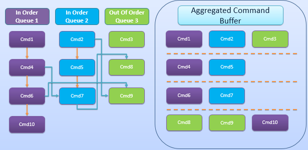
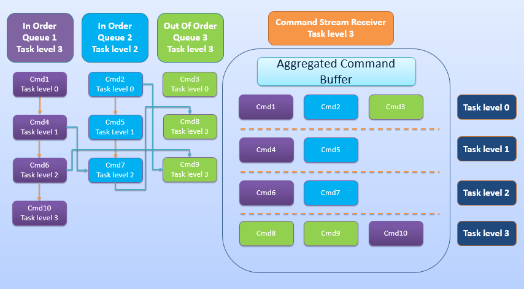
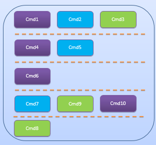

# Commands aggregation

This sample presents how to achieve concurrent kernel execution submitted to multiple independent command queues and how much it speeds up application execution.

## Main assumptions



10 commands are enqueued to 3 queues. Dependencies between commands are marked on diagram. There are event dependencies marked with blue lines and implicit queue dependencies marked with orange lines, it is also worth noting that there are no implicit dependencies in Out-Of-Order Queue (OOQ).

Pseudocode is as follows:
```c++
enqueue(ioq1, cmd1);
enqueue(ioq2, cmd2, event1);         // returns event1
enqueue(ooq3, cmd3);
enqueue(ioq1, cmd4, event2);         // returns event2
enqueue(ioq2, cmd5);
enqueue(ioq1, cmd6, event3);         // returns event3
enqueue(ioq2, cmd7, event2, event4); // waits for event2 and returns event4
enqueue(ooq3, cmd8, event4);         // waits for event4
enqueue(ooq3, cmd9, event1&event3);  // waits for event1 and event3
enqueue(ioq1, cmd10);
flush();                             // flush all queues
```

## Limitations

There are some limitations related to parallel execution:
* Concurrent execution for commands returning an event in an In-Order Queue (IOQ) is disabled by default, to enable it in such scenario one OOQ needs to be created.
* Turning on profiling for a given command queue prevents concurrent execution, that's why the sample measures wall clock CPU time.
* Aggregation doesn't work for commands blocked by user events.
* Performance boost depends on enqueue calls order.

## How enqueue calls order affects performance?

There could be many command queues associated with one device but there is only one Command Stream Receiver (CSR) associated with one device, that's why the model is called N:1. CSR is responsible for consuming command streams coming from multiple command queues, aggregation of commands and later submission to the hardware.

Synchronization between commands is based on task levels. Both CSR, command queues and commands have their own task level. When command is enqueued, task level of command and task level of command queue are set based on current task level of command queue and dependencies of command, then command queue passes the command to CSR that updates its own task level (if task level of received command is higher than current CSR's task level) and returns its own task level to command queue which updates its own task level to the returned value.

Until flush function is called on command queue, CSR creates command buffer which is submitted to the hardware when flush function is called.

There are 3 cases of updating the task level in command queue:

* Command has no dependencies on other commands or events:

  Command queue doesn't change its own task level


* Command has a dependency on another command (in IOQ each command has implicit dependency on previous command):

  Command queue's task level has to be greater than task level of previous command


* Command is blocked by events:

  Command queue's task level has to be greater than current task level and task level of each event



### Examples

* When Cmd4 is enqueued before Cmd2 then Cmd2 won't be aggregated with Cmd1.


* When Cmd9 is enqueued before Cmd7 then Cmd7 won't be aggregated with Cmd6.



## Performance boost

The sample allows to enqueue kernels as described above or enqueue all commands to one IOQ to present serialized version.

Results from Skylake i7-6500U:

* Parallel execution
```
commands_aggregation
[2018-04-30 02:08:31.757047] [0x0000053c] [info]    Version: 0.1.0+dev.8502bc4
[2018-04-30 02:08:31.757047] [0x0000053c] [info]    Work size: 512
[2018-04-30 02:08:31.978869] [0x0000053c] [info]    OpenCL device: Intel(R) HD Graphics 520
[2018-04-30 02:08:35.484792] [0x0000053c] [info]    Kernels execution: 3.249367s
[2018-04-30 02:08:35.484792] [0x0000053c] [info]    Total: 3.725744s
```

* Serialized execution
```
commands_aggregation --in-order
[2018-04-30 02:08:38.281968] [0x00001a24] [info]    Version: 0.1.0+dev.8502bc4
[2018-04-30 02:08:38.281968] [0x00001a24] [info]    Work size: 512
[2018-04-30 02:08:38.485114] [0x00001a24] [info]    OpenCL device: Intel(R) HD Graphics 520
[2018-04-30 02:08:46.079676] [0x00001a24] [info]    Kernels execution: 7.372259s
[2018-04-30 02:08:46.079676] [0x00001a24] [info]    Total: 7.809311s
```