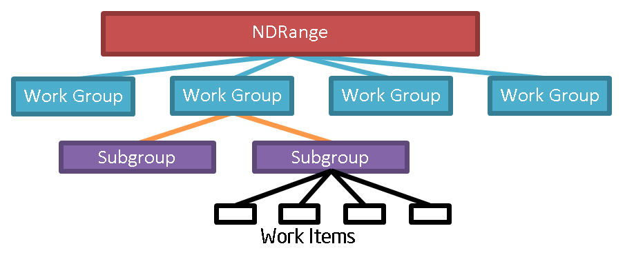
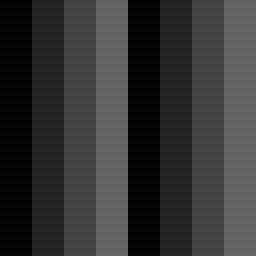

# Subgroups Visualization

In this tutorial you will visualize how an NDRange is partitioned into subgroups.

This tutorial requires support for OpenCL 2.1, or either the `cl_khr_subgroups` or
`cl_intel_subgroups` extensions.  Because the tutorial compiles for an OpenCL
2.0 device (using `-cl-std=CL2.0`) by default, some modifications may be needed to
run it on an OpenCL 1.2 device.

## What is a Subgroup?

A Subgroup is a collection of Work Items.  It is another level in the execution hierarchy,
between Work Groups and Work Items.  For the Intel GPU implementation, Work Items in a
Subgroup execution on the same EU Thread, which enables usage of unique hardware features.

## Core Subgroup Capabilities

Core Subgroup capabilities are exposed by `cl_khr_subgroups` and OpenCL 2.1.  Most core
Subgroup functions have close Work Group function analogies.  For example, there are
Subgroup functions to `get_sub_group_id()` and to `get_sub_group_local_id()`, for example,
which are very similar to the Work Group functions to `get_group_id()` and to `get_local_id()`.

The key differences between Subgroups and Work groups are:

1. Unlike Work Groups, where the application controls the Work Group size, the OpenCL
   implementation chooses the Subgroup size.
2. Subgroups are exclusively 1-Dimensional.
3. There is no "Subgroup Local" address space.

On Intel GPU devices, the subgroup size the compiler chose for a particular kernel may
be queried using the `clGetKernelWorkGroupInfo` API and passing `CL_KERNEL_PERFERRED_WORK_GROUP_SIZE_MULTIPLE`.

## Visualizing Subgroups

The goal of this tutorial is to visualize how an NDRange is partitioned into Subgroups.
You will do this by editing `subgroups_visualization_kernel.cl`.  By default, the
kernel in this file outputs the Work Group ID to an image.  Change it so it outputs the
Subgroup ID instead, by changing the call to `get_group_id(0)` to `get_sub_group_id()`.

The Global Work Size determines the image dimensions.  The application is set up to
use a Global Work Size of 256x256 initially, and a Local Work Size of 128x1.  This
means that if you run the applcation without any changes, you should see two Work Groups
across (256 divided by 128 is 2).

For Intel GPUs, the Subgroup size for very small kernels (like this one) is likely to
be 32.  This means that there will be four Subgroups per Work Group (128 divided by
32 is 4).  So, if you output the Subgroup ID instead of the Work Group ID, you should
see four Subgroups for each of the two Work Groups.

The file `subgroups_visualization_solution.cl` shows one way to produce the output above.

## Extra Credit

Here are some additional ideas to experiment with:

* Output a different Subgroup value to the image: perhaps the Subgroup Local ID or the Subgroup Size?
* Use the `-l` command line option to choose a Local Work Size larger than or smaller than 128x1.
* Use the "required Subgroup size" kernel attribute to change the Subgroup size.  Note, this
  requires the `cl_intel_required_subgroup_size` extension.

## Usage
    subgroups_visualization

----

Intel and the Intel logo are trademarks of Intel Corporation or its subsidiaries in the U.S. and/or other countries.

*Other names and brands may be claimed as the property of others.

OpenCL and the OpenCL logo are trademarks of Apple Inc. used by permission by Khronos.
